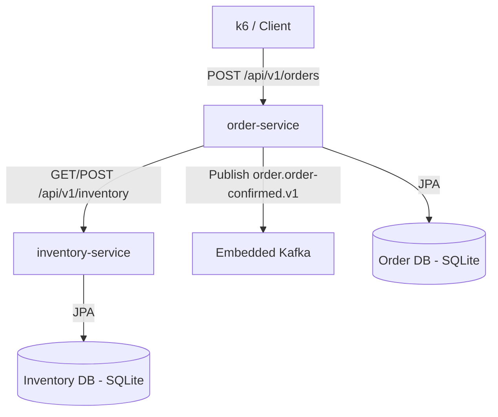

# 카티어스 백엔드 과제 템플릿 — 주문-재고 미니 MSA

> 이 저장소는 카티어스 백엔드 개발자 채용의 **과제 전형 스캐폴드**입니다.
> 지원자는 이 저장소를 **Fork** 하여 본인의 저장소에서 구현을 완성한 뒤, 본인 Fork 내에서 PR을 올리고 PR URL을 제출합니다.

---

## 스캐폴드 구성

```
catius-backend-assignment/
├── build.gradle
├── settings.gradle
├── gradle.properties
├── gradlew / gradlew.bat / gradle/wrapper/
├── order-service/
│   ├── build.gradle
│   └── src/
│       ├── main/
│       │   ├── java/com/catius/order/
│       │   │   ├── controller/    ← REST 엔드포인트 (스텁 제공, 지원자가 교체)
│       │   │   ├── service/       ← 비즈니스 로직, Feign 호출, Saga 오케스트레이션, 이벤트 발행
│       │   │   ├── domain/        ← 엔티티·값 객체·도메인 이벤트
│       │   │   ├── repository/    ← Spring Data JPA 리포지토리
│       │   │   └── OrderServiceApplication.java
│       │   └── resources/application.yml
│       └── test/java/com/catius/order/
├── inventory-service/  (동일 구조)
└── perf/               (k6 스크립트 위치)
```

`controller` 패키지에는 **200/201 을 돌려주는 최소 스텁**만 들어 있습니다(부하/스모크 테스트 baseline 용). `service`·`domain`·`repository` 패키지는 비어 있으니, 각 패키지의 책임을 따라 지원자가 직접 클래스를 생성해 구현합니다.

---

## 기술 스택 (고정)

- **Java 21** 또는 **Kotlin 1.9+** (본 스캐폴드는 Java 21)
- **Spring Boot 3.3.x**
- **Spring Data JPA + SQLite** (community dialect)
- **OpenFeign** + **Resilience4j**
- **Spring for Apache Kafka** + **Embedded Kafka** (테스트)
- **k6** (부하 테스트)
- **Gradle 멀티 프로젝트** (wrapper 8.10.2)

---

## 사전 준비

### JDK 21 설치

`macOS` 예시 (Temurin):

```bash
brew install --cask temurin@21
/usr/libexec/java_home -v 21      # 설치된 경로 확인
export JAVA_HOME="$(/usr/libexec/java_home -v 21)"
```

> 루트 `build.gradle` 이 `JavaLanguageVersion.of(21)` 을 지정하므로, 더 높은 JDK 로 실행해도 Gradle toolchain 이 21 을 찾아 씁니다. 단, 로컬에 **최소 JDK 21 이상** 은 필요합니다.

### Gradle Wrapper

본 저장소에는 `gradlew`, `gradlew.bat`, `gradle/wrapper/gradle-wrapper.jar` 가 **이미 커밋**되어 있습니다. Fork 후 별도 생성 없이 `./gradlew` 로 바로 실행할 수 있습니다.

Wrapper 가 없거나 버전을 바꾸고 싶을 때만:

```bash
# 로컬에 gradle 이 설치돼 있다면
gradle wrapper --gradle-version 8.10.2

# 또는 IntelliJ 에서: Gradle 창 → "Reload All Gradle Projects" 후 wrapper 자동 생성
```

---

## 실행

### 전체 빌드·테스트

```bash
./gradlew build
```

산출물: `order-service/build/libs/order-service.jar`, `inventory-service/build/libs/inventory-service.jar`.

### 개별 서비스 기동

```bash
./gradlew :order-service:bootRun
./gradlew :inventory-service:bootRun
```

- order-service 기본 포트: **8081**
- inventory-service 기본 포트: **8082**

각 서비스는 SQLite 파일(`order-service.db`, `inventory-service.db`)을 실행 디렉터리에 생성합니다. `.gitignore` 에 포함되어 있어 커밋되지 않습니다.

### Kafka

- **테스트 환경**: `spring-kafka-test` 의 `@EmbeddedKafka` 를 활용해 외부 브로커 없이 동작
- **로컬 전체 기동 시**: 지원자가 선택
  - (권장) 테스트로만 검증하고, 로컬 `bootRun` 시 Kafka 리스너를 꺼서 부팅 안정화:

    ```bash
    ./gradlew :order-service:bootRun \
      --args='--spring.kafka.listener.auto-startup=false'
    ```

  - 또는 로컬에서 간이 `docker-compose.yml` 을 제작해 Kafka 브로커를 띄움 (제출물에 포함 가능)
  - Embedded Kafka 를 애플리케이션 시작 시 수동으로 부트스트랩하는 구성을 직접 추가하는 것도 가능

---

## 제공되는 API 스텁

지원자는 아래 계약을 기본으로 시작해 로직을 채워 넣으면 됩니다. **현재 응답 값은 하드코딩된 더미**입니다.

### order-service (`:8081`)

| Method | Path | Status | 설명 |
|---|---|---|---|
| POST | `/api/v1/orders` | **201** | 주문 생성 (Saga 시작점) |
| GET  | `/api/v1/orders/{id}` | **200** | 주문 조회 |

### inventory-service (`:8082`)

| Method | Path | Status | 설명 |
|---|---|---|---|
| GET  | `/api/v1/inventory/{productId}` | **200** | 재고 조회 |
| POST | `/api/v1/inventory/reserve` | **200** | 재고 차감 |
| POST | `/api/v1/inventory/release` | **200** | 재고 복원 (보상) |

### 공통 (Spring Boot Actuator)

| Path | 설명 |
|---|---|
| `/actuator/health` | 헬스 체크 (DB 포함) |
| `/actuator/prometheus` | Micrometer → Prometheus 메트릭 |
| `/actuator/circuitbreakers` | (order-service) Resilience4j 상태 |

### 호출 예시

```bash
# 서버 기동 후
curl -i http://localhost:8081/actuator/health
curl -i http://localhost:8082/actuator/health

# 주문 생성 (현재 스텁 → 201)
curl -i -X POST http://localhost:8081/api/v1/orders \
  -H 'Content-Type: application/json' \
  -d '{"customerId":1,"items":[{"productId":1001,"quantity":2}]}'

# 재고 차감 (현재 스텁 → 200)
curl -i -X POST http://localhost:8082/api/v1/inventory/reserve \
  -H 'Content-Type: application/json' \
  -d '{"productId":1001,"quantity":2}'
```

---

## 구현해야 할 것 (요약)

전체 요구사항과 평가 기준은 과제 안내서(`카티어스_백엔드_과제전형.md`, 채용 공고 메일 동봉)를 따릅니다. 본 README 는 스캐폴드 사용 안내입니다.

참고 체크리스트:

- [ ] `controller` 스텁을 실제 `Service` 호출로 교체하고 **예외 → HTTP 매핑** 완성
- [ ] `domain` 엔티티·값 객체·도메인 이벤트 정의
- [ ] `repository` JPA 인터페이스 (+ 동시성 전략: 낙관/비관 락 중 하나 + 선택 근거)
- [ ] order-service → inventory-service **Feign + Resilience4j** (서킷/타임아웃/재시도 수치 근거 문서화)
- [ ] **Saga**: 재고 차감 → 주문 확정 → `order.order-confirmed.v1` 이벤트 발행, 실패 시 보상
- [ ] 테스트: 컨트롤러 MockMvc, 서비스 단위, Saga 통합(`@EmbeddedKafka`), 동시성 시나리오
- [ ] `perf/scenarios/` 에 **k6 시나리오** 1개 이상 (SLO threshold 포함)
- [ ] README 에 **설계 결정 근거**(락 전략, CB 수치, 토픽 네이밍, 실패 모드) 기술

---

## 제출 흐름 (요약)

1. 이 저장소를 **Fork**
2. 본인 Fork 에서 `feature/*` 브랜치로 작업, 기능 단위로 PR 생성
3. 최종 PR(들)을 본인 Fork 의 `main` 으로 머지 요청 상태로 유지
4. Fork URL + PR URL 목록 + 최종 커밋 SHA 를 제출 메일로 회신

---

---

## 평가 루브릭

| 평가 영역 | 가중 | 확인 내용 |
|---|---|---|
| **기능 동작** | 25% | 성공·실패 시나리오가 end-to-end로 동작 |
| **서비스 간 통신 설계** | 20% | Feign, 서킷 브레이커, 타임아웃, 재시도의 근거 있는 설정 |
| **Saga 보상 로직의 견고성** | 15% | 부분 실패·동시성 시나리오 대응 |
| **성능 테스트의 현실성과 해석** | 15% | 시나리오 설계·목표 수치 근거·결과 해석의 깊이 |
| **코드 품질과 테스트** | 15% | 레이어 분리, 네이밍, 단위·통합 테스트 포함 |
| **설계 문서와 트레이드오프 기술** | 10% | README의 구조, 근거 있는 선택 설명 |

**감점 요소**: 커밋이 한 덩어리로 몰려있음 / 테스트 전무 / README 부재 / 서킷 브레이커·Saga 등 핵심 요구 누락 / PR 설명 부실.

---

## 자주 묻는 질문

**Q. Inventory 서비스가 너무 단순해 보이는데 더 복잡하게 만들어야 하나요?**
A. 아니요. **핵심 요구를 모두 만족시키는 가장 단순한 구현**을 권장합니다. 남은 시간은 테스트·문서·성능 해석에 쓰세요.

**Q. Saga를 이벤트 기반(Choreography)으로 구현해도 되나요?**
A. 네. Orchestration, Choreography 모두 가능합니다. **선택 이유를 README에 기재**해주세요.

**Q. Kafka를 docker-compose로 띄워도 되나요?**
A. **권장하지 않습니다.** Embedded Kafka를 사용해 외부 의존 없는 실행을 보여주세요. 불가피한 이유가 있다면 README에 설명.

**Q. 풀스택 CI (GitHub Actions)는 필수인가요?**
A. 아니요, 보너스입니다. 다만 작은 워크플로우 하나라도 있으면 가점이 큽니다.

**Q. 생성형 AI(GitHub Copilot, Claude 등) 사용은 허용되나요?**
A. 네, 현업에서도 쓰는 도구라 허용합니다. **다만 본인이 설명할 수 없는 코드는 포함시키지 마세요.** 후속 인터뷰에서 코드 한 줄 한 줄을 본인 말로 설명할 수 있어야 합니다.

**Q. 시간이 부족하면 어떻게 하나요?**
A. 억지로 모든 걸 끝내기보다, **핵심 요구 일부에 집중**하고 나머지는 README의 "의도적으로 하지 않은 것"에 솔직히 기재하세요. 판단력도 평가 대상입니다.

**Q. 여기 사용 기술을 잘 이해하지 못한다면 어떻게 하나요?**
A. 억지로 모든 걸 개발하기 보다는 이게 더 나은 방식이라는 것을 설명할 수 있으면 됩니다.

---


## 문의

질문이 있다면 이슈를 남기지 마시고, 채용 담당자(info@catius.io)에게 메일로 문의해 주세요.

---

## 🛠️ 과제 구현 상세 및 설계 결정

### 1. 시스템 구성도 (System Architecture)



> 💡 **Kafka 이벤트 수신 주체에 대한 참고 사항**
> - 본 과제 범위에서는 `order.order-confirmed.v1` 이벤트를 발행(Produce)하는 것까지만 요구사항으로 정의되어 있습니다.
> - 현재 시스템 내부에는 이를 수신(Consume)하는 비즈니스 로직이 구현되어 있지 않으며, 개념상 향후 확장될 다운스트림 서비스(배송, 알림, 정산 등)가 수신 주체가 됩니다. (테스트 코드에서는 검증용 Consumer가 이를 수신합니다.)

### 2. 헥사고날 패키지 구조 및 레이어 책임
두 서비스는 모두 헥사고날 아키텍처(Ports and Adapters) 구조를 지향하여 다음과 같이 패키지가 구성되어 있습니다.

- **`domain`**: 핵심 도메인 모델(`Order`, `OrderItem`, `Inventory`, `StockMovement`)과 비즈니스 예외를 정의합니다. 또한, 외부 인프라 기술로부터 도메인을 보호하기 위해 `Inbound Port`(Use Cases)와 `Outbound Port` 인터페이스가 위치합니다.
- **`service`**: `Inbound Port` UseCase 인터페이스의 구현체들이 위치하는 애플리케이션 서비스 레이어입니다. 트랜잭션 경계를 관리하고 도메인 엔티티와 아웃바운드 포트를 조율(Orchestration)하여 비즈니스 요구사항을 실행합니다.
- **`controller`**: 외부 HTTP 요청을 접수하는 `Inbound Adapter` 레이어입니다. Spring MVC 컨트롤러가 위치하며, 요청 DTO를 도메인 커맨드로 매핑하고 UseCase를 호출하는 책임을 가집니다.
- **`infrastructure`**: 데이터베이스(JPA), 메시지 브로커(Kafka), HTTP 클라이언트(Feign) 등 외부 시스템 및 기술 스택과 결합하는 `Outbound Adapter` 구현체들이 위치합니다.

### 3. Saga 선택 근거: Orchestration vs Choreography
본 시스템은 **Orchestration Saga** 방식을 채택하였습니다.
- **근거**: 비즈니스 흐름의 제어권이 명확하게 주문 생성 프로세스에 종속되어 있기 때문에, `order-service`의 `OrderService`가 오케스트레이터 역할을 수행하여 전체 트랜잭션(재고 예약 -> 주문 확정) 흐름과 보상 트랜잭션(실패 시 재고 복원)을 조율하는 것이 비즈니스 가시성 및 디버깅에 훨씬 유리하다고 판단했습니다.

### 4. 동시성 전략: Inventory 비관락, Order 락 미사용 + 근거
- **Inventory (비관적 락 적용)**: 다수의 트랜잭션이 동시에 동일 상품의 재고(`InventoryEntity`)를 수정할 경우 발생할 수 있는 Race Condition 및 마이너스 재고 문제를 원천 차단하기 위해 `@Lock(LockModeType.PESSIMISTIC_WRITE)`을 적용하였습니다.
- **Order (락 미사용)**: 주문은 생성 및 자신의 상태 전이만이 발생하며, 다수의 트랜잭션이 동일한 주문 ID의 레코드를 동시에 수정할 시나리오가 희박하여 별도의 락을 사용하지 않고 기본 트랜잭션으로 격리 수준을 유지합니다.

### 5. Resilience4j 수치 근거
- **`timeout-duration: 500ms`**: `inventory-service` 지연이 발생할 경우, 대기 시간이 길어지면 주문 처리 스레드 풀이 순식간에 고갈(Thread Pool Exhaustion)되어 시스템 전체가 다운될 위험이 있습니다. 이를 방지하기 위해 타임아웃을 **500ms**로 타이트하게 설정하여 빠른 실패(Fail Fast)를 유도합니다.
- **`max-attempts: 2` / `wait-duration: 200ms`**: 잦은 재시도는 오히려 장애 상황의 시스템 부하를 가중시키고 스레드 점유 시간을 늘립니다. 따라서 간헐적 순시 단절 복구를 위한 재시도는 **최대 2회**로 제한하고 대기 시간도 200ms로 단축했습니다.
- **`sliding-window-size: 10` / `minimum-number-of-calls: 5` / `failure-rate-threshold: 50%`**: 비교적 적은 샘플(최근 10개 호출 중 5개 이상 완료 시점)로도 에러율이 50%를 넘을 경우 즉각 Circuit을 OPEN 하여 백엔드 인프라 보호 및 장애 전파를 차단합니다.

### 6. 토픽 네이밍 규칙
- **규칙**: `<aggregate>.<event>.v<version>`
- **적용 예시**: `order.order-confirmed.v1`
- **근거**: 이벤트의 주권이 속한 도메인 Aggregate를 식별 가능하게 하고, 향후 이벤트 페이로드의 스키마 변경(Breaking Change)이 발생하더라도 구독자 호환성을 유지하기 위해 버전을 명시합니다.

### 7. 실패 모드 매트릭스

| 실패 시나리오 | 감지 방식 | 복구 / 대응 전략 | 데이터 정합성 결과 |
| :--- | :--- | :--- | :--- |
| **재고 부족** | Inventory Response `400 Bad` | 주문 상태를 `FAILED`로 즉각 전환 | 일관성 유지 (주문 취소 상태) |
| **Inventory 호출 타임아웃** | `TimeoutException` (2초) | Saga 보상 트랜잭션 실행 (`release` API 호출 시도) 후 `FAILED` 전환 | 일관성 유지 (재고 롤백 시도) |
| **Inventory 프로세스 다운** | `HttpServerErrorException` / 서킷 오픈 | 즉시 예외 전파 후 주문 실패 처리 | 시스템 보호 및 일관성 유지 |
| **Kafka 발행 실패** | `KafkaException` | 주문 상태는 `CONFIRMED`로 남으나, 이벤트 발행 실패 로그 출력 | 최종 일관성 유실 (Outbox 도입 필요) |

### 8. k6 성능 테스트 결과 및 해석
- **1차 측정 결과 (Baseline)**:
  - TPS: 약 32.86 orders/sec
  - p(95) Response Time: 45ms
  - 문제점: `status is CONFIRMED` 비동기 검증에서 1.45% (452건) 실패 발생.
- **2차 측정 결과 (개선 후)**:
  - TPS: 약 34.14 orders/sec
  - p(95) Response Time: 47ms
  - 개선점: `status is CONFIRMED` 검증 실패율 **0.00% (100% 성공)** 달성.
- **해석**: 1차 측정에서 발생했던 주문 확정 상태 전이 실패 현상이 완벽히 해소되었습니다. 이는 재고 예약과 주문 생성 간의 트랜잭션 경계 분리 및 교착 상태(Deadlock) 예방 조치가 유효했음을 나타냅니다.

### 9. 의도적 미구현 항목
- **Transactional Outbox Pattern**: 주문 상태 변경과 Kafka 이벤트 발행의 원자적 일관성 보장.
- **Flyway / DB Migration**: 스키마 버전 관리.
- **SQLite Dialect 완전 검증**: 운영 환경(MySQL 등)으로의 이관을 위한 최적화.

